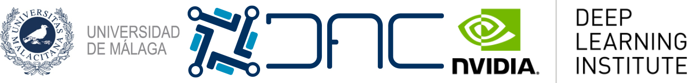

# Getting Started with AI on Jetson Nano: Jetson Samples

These examples have been developed for the course "Getting Started with AI on Jetson Nano", taught by Francisco M. Castro with the collaboration of NVIDIA.


## How to use

Clone this repository with git and upload notebooks to your Google Drive:

```
git clone https://github.com/fmcp/jetson_samples
```

Maybe neccesary:
```
sudo pip3 install --global-option=build_ext --global-option="-I/usr/local/cuda/include" --global-option="-L/usr/local/cuda/lib64" pycuda
```

Or copy this colabs in your Google Drive:

* Pract1: [](https://colab.research.google.com/drive/1O60VH-dH2JrTpcKJh9LCqdxsq2RVlgcv)
* Pract2: [](https://colab.research.google.com/drive/1Q8M0Kw-Ub9xBOUuNAHIwWlGRVOUPXqT0)

## Proposed projects
* Identification of bottles with different drinks
* Identification of playing card suits
* Recognition of handwritten music notes
* Counting people in a room
* Facial emotion recognition

## Authors

* **Francisco M. Castro** - [fmcp](https://github.com/fmcp) (fcastro@uma.es) [](https://www.linkedin.com/in/francisco-manuel-castro-pay%C3%A1n-5099248b/)
* **Paula Ruíz Barroso** - [PaulaRuizB](https://github.com/PaulaRuizB) (pruizb@uma.es) [](https://www.linkedin.com/in/paula-ruiz-barroso/)



## License

This project is licensed under the MIT License - see the [LICENSE.md](LICENSE.md) file for details
 
